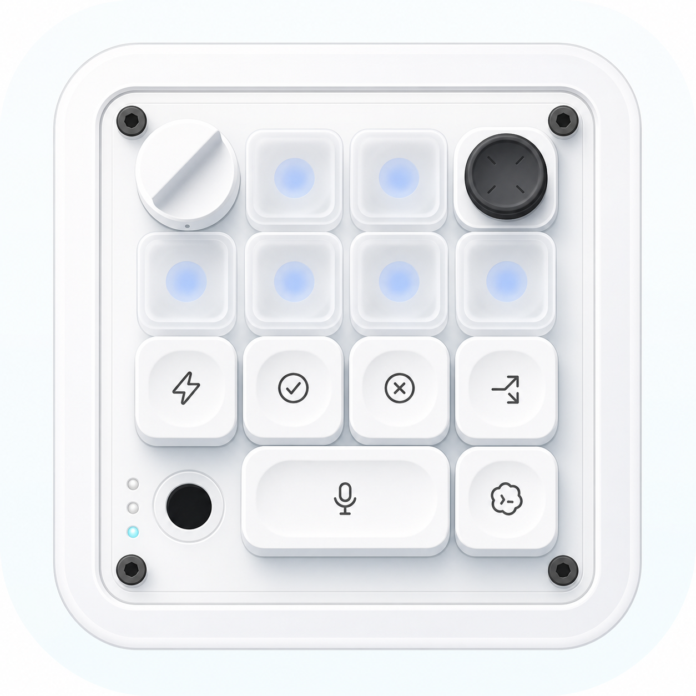

# Codex Micro Mobile

An unofficial, open-source iPhone control surface for the Codex desktop app.
The repository contains both sides of the local connection:

- a native SwiftUI iPhone app that mirrors the Codex Micro control surface;
- a TypeScript bridge for macOS and Windows;
- QR pairing over the local network with a unique token and pinned TLS
  certificate;
- the optional Stream Deck integration from the upstream project.

> [!IMPORTANT]
> This is an independent community project. It is not made, supported, or
> endorsed by OpenAI, Apple, Elgato, or Work Louder. It uses undocumented Codex
> desktop internals and may need an update after a Codex release.



## What the app can control

- Six live Codex Micro agent slots and their current states.
- The reasoning dial, including turn, click, and hold behavior.
- The four-way joystick.
- Fast, Approve, Decline, Fork, microphone, Send, and the installed Codex
  keycap assignments.
- Weekly account capacity, selected tasks, attention events, widgets, and Live
  Activities.
- Multiple independently paired Mac and Windows computers.

The iPhone interface is original SwiftUI, uses SF Symbols and native iOS 26
Liquid Glass with a material fallback for iOS 17-25. Official OpenAI keycap
artwork is not included.

## Repository layout

| Path | Purpose |
|---|---|
| `ios/` | Native SwiftUI app, widgets, tests, assets, and Xcode project |
| `src/` | Renderer bridge, typed relay protocol, pairing, state, and actions |
| `launcher/` | macOS and Windows launch/configuration entry points |
| `scripts/` | Build, signing setup, validation, and release-audit helpers |
| `test/` | Node bridge and packaging tests |
| `docs/` | Architecture, security, platform setup, and troubleshooting |

The previously explored signed Companion app and DMG are deliberately not part
of this repository. Users build the bridge and iPhone app from source.

## Requirements

- Codex desktop installed on the computer to be controlled.
- Node.js 20 or newer. On macOS, the launcher can also use the compatible Node
  runtime bundled with Codex.
- A Mac with Xcode to build and install the iPhone app.
- iOS 17 or newer.
- The computer and iPhone on the same private Wi-Fi for first pairing.

## Quick start on macOS

```zsh
git clone https://github.com/licodingdevai/codex-micro-mobile.git
cd codex-micro-mobile
npm ci
npm run build
chmod +x release/codex-deck-launcher-macos/start-codex-deck.sh
release/codex-deck-launcher-macos/start-codex-deck.sh mobile-local-config
```

The last command creates a private pairing QR code. Do not share or publish it.
Scan it with the iPhone Camera after installing the iOS app.

Build and install the iPhone app:

```zsh
./scripts/configure-ios-signing.sh com.yourname.CodexMicro
open ios/CodexDeckMobile.xcodeproj
```

In Xcode, select your Apple team and physical iPhone, then choose
**Product > Run**. Full steps are in [iPhone installation](docs/IOS_INSTALL.md)
and the Turkish [Kurulum rehberi](KURULUM.md).

## How it works

```text
iPhone Codex Micro
        │  authenticated WSS + pinned certificate
        ▼
local TypeScript bridge
        │  loopback-only Chrome DevTools connection
        ▼
Codex renderer host-event bus
        │
        ├─ codex-micro-device-state-changed
        ├─ codex-micro-hid-event
        └─ codex-micro-joystick-event
```

The bridge does not install a virtual HID driver, use Accessibility, type
keyboard shortcuts, or patch the Codex application. This pairing is the
project's own local bridge protocol; it is separate from Codex's official
Remote pairing feature.

## Security

- Chrome DevTools stays bound to `127.0.0.1` and is never exposed to the LAN.
- The phone connects only to a typed relay with a random token and pinned,
  per-installation TLS certificate.
- Wildcard and arbitrary public-IP listeners are rejected.
- Pairing tokens, certificates, local host state, logs, signing configuration,
  build outputs, and official keycap files are excluded from Git.
- There is no telemetry, hosted relay, analytics service, or update service.

See [SECURITY.md](SECURITY.md) and
[Architecture and security](docs/ARCHITECTURE.md) before exposing any service
through Tailscale or another network.

## Development

```zsh
npm ci
npm run build
npm run check
npm test
npm run audit:release
```

The iOS project has no CocoaPods or third-party Swift package dependencies.
Public defaults compile without a personal signing identity; use
`scripts/configure-ios-signing.sh` only for a physical-device build.

## Origin, license, and trademarks

This project is derived from
[`dazer1234/codex-stream-deck`](https://github.com/dazer1234/codex-stream-deck)
at revision `6d7d14b9c966de305617a43a7ac22c7034ac075e`. The original MIT
license and copyright notice are preserved. See
[DERIVATIVE_NOTICE.md](DERIVATIVE_NOTICE.md).

The mobile-control-surface exploration was inspired in part by the public
concept shared by [Shikhar (@xikhar)](https://x.com/xikhar). Codex Micro Mobile
is an independent implementation; no source code or artwork from that concept
is included.

Code and original artwork are licensed under [MIT](LICENSE). OpenAI, Codex,
ChatGPT, Apple, Elgato, Stream Deck, and Work Louder names and marks belong to
their respective owners.
